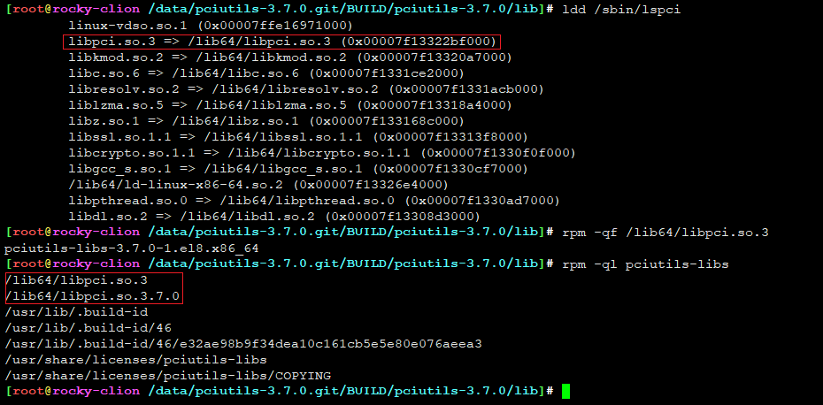
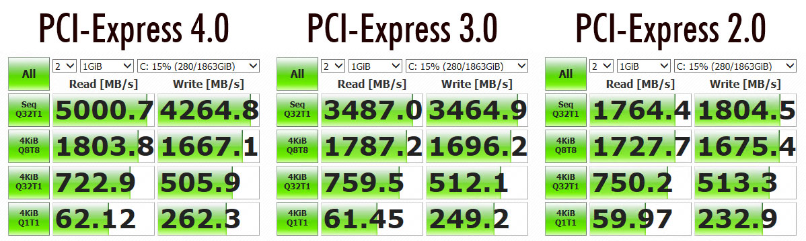

# pciutils-3.7.0 学习

**Peripheral Component Interconnect (PCI)**


```
Something I hope you know before go into the coding~
First, please watch or star this repo, I'll be more happy if you follow me.
Bug report, questions and discussion are welcome, you can post an issue or pull a request.
```

## 软件信息

```
[root@rocky ~]# yum info pciutils
Last metadata expiration check: 0:19:02 ago on Wed 29 Jun 2022 09:29:49 PM CST.
Installed Packages
Name         : pciutils
Version      : 3.7.0
Release      : 1.el8
Architecture : x86_64
Size         : 211 k
Source       : pciutils-3.7.0-1.el8.src.rpm
Repository   : @System
From repo    : anaconda
Summary      : PCI bus related utilities
URL          : http://atrey.karlin.mff.cuni.cz/~mj/pciutils.shtml
License      : GPLv2+
Description  : The pciutils package contains various utilities for inspecting and
             : setting devices connected to the PCI bus.

[root@rocky ~]# rpm -ql pciutils
/lib64/libpci.so.3
/lib64/libpci.so.3.6.4

/sbin/lspci
/sbin/setpci
/sbin/update-pciids

/usr/share/doc/pciutils/COPYING
/usr/share/doc/pciutils/ChangeLog
/usr/share/doc/pciutils/README
/usr/share/doc/pciutils/pciutils.lsm
```



## 目录

* [spec分析](docs/spec分析.md)
* [strace分析程序调用](docs/strace分析程序调用.md)
* [update-pciids脚本](docs/update-pciids.md)
* [setpci使用](docs/setpci使用.md)
* [lspci使用](docs/lspci使用.md)
* [python实现lspci](docs/python实现lspci.md)
* [python解析pci config文件](docs/python解析pci_config文件.md)


## 总结

* 每系统可以有256个PCI总线，每个总线上可以有32个设备，每个设备可以具有8个功能（每个功能作为一个PCI设备）[256*8*8 = 16384]


## 图示





---
