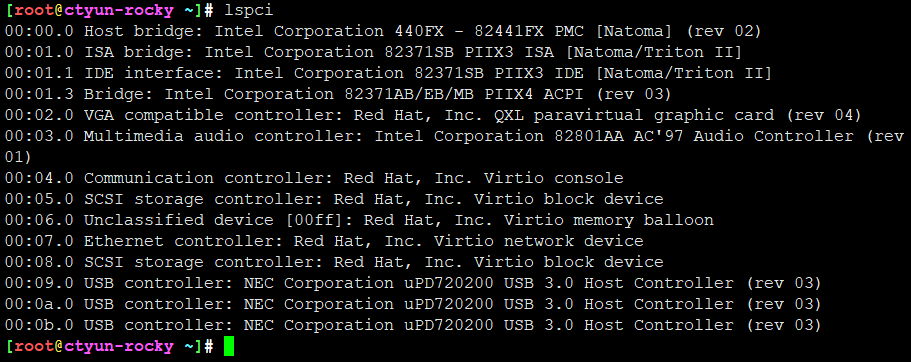

# lspci

* lspci 默认读取sysfs列出pci相关信息
* 可以通过slot、device来过滤只显示所需
* 默认都是精简输出，可以通过```-vvv -xxxx -nn```显示详细信息
* lspci只能检索，不能修改值。setpci可以设置值，修改局部寄存器值，也可以检索局部值
* 根据sloat检索，肯定最多只有一个设备，每个设备的slot不同
* 根据divice可能有多个，因为还有subsystem没有锚定
* 其实最花里胡哨的就是看参数，比如你关注网卡、显卡，可以具体到对应参数，可以直接限制外设的某些功能实用

```
lspci: invalid option -- '-'
Usage: lspci [<switches>]

Basic display modes:
-mm		Produce machine-readable output (single -m for an obsolete format)
-t		Show bus tree

Display options:
-v		Be verbose (-vv or -vvv for higher verbosity)
-k		Show kernel drivers handling each device
-x		Show hex-dump of the standard part of the config space
-xxx		Show hex-dump of the whole config space (dangerous; root only)
-xxxx		Show hex-dump of the 4096-byte extended config space (root only) 输入N个X效果等同，底层实现是一个整型
-b		Bus-centric view (addresses and IRQ's as seen by the bus)
-D		Always show domain numbers
-P		Display bridge path in addition to bus and device number
-PP		Display bus path in addition to bus and device number

Resolving of device ID's to names:
-n		Show numeric ID's
-nn		Show both textual and numeric ID's (names & numbers) 显示厂家及设备ID具体数值
-q		Query the PCI ID database for unknown ID's via DNS
-qq		As above, but re-query locally cached entries
-Q		Query the PCI ID database for all ID's via DNS

Selection of devices:
-s [[[[<domain>]:]<bus>]:][<slot>][.[<func>]]	Show only devices in selected slots
-d [<vendor>]:[<device>][:<class>]		Show only devices with specified ID's

Other options:
-i <file>	Use specified ID database instead of /usr/share/hwdata/pci.ids
-p <file>	Look up kernel modules in a given file instead of default modules.pcimap
-M		Enable `bus mapping' mode (dangerous; root only)

PCI access options:
-A <method>	Use the specified PCI access method (see `-A help' for a list)
-O <par>=<val>	Set PCI access parameter (see `-O help' for a list)
-G		Enable PCI access debugging
-H <mode>	Use direct hardware access (<mode> = 1 or 2)
-F <file>	Read PCI configuration dump from a given file
```




---
