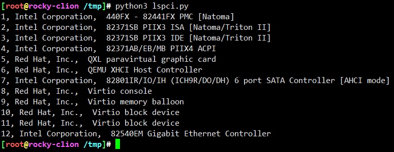
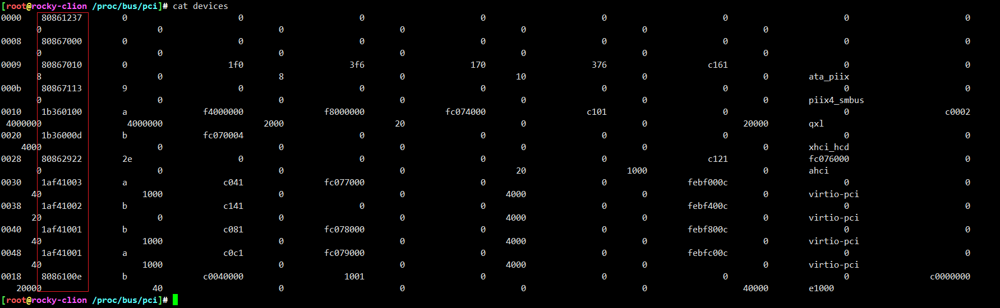
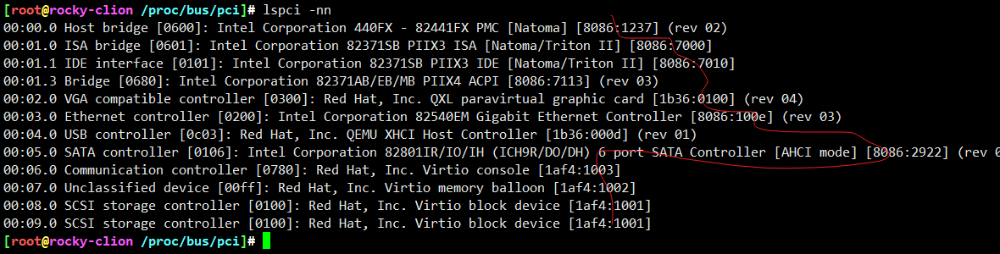

# python实现lspci

* pciutils本质就是读写/sys/bus/pci目录下的内容，那么python，毫无疑问也可以

```
#!/usr/bin/env python3

devices_file = open('/proc/bus/pci/devices').readlines()
raw_id = [x.split('\t')[1] for x in devices_file]
vend_and_dev = [(x[:4], x[4:]) for x in raw_id]

pci_ids = open('/usr/share/hwdata/pci.ids').readlines()
ids_lib = {}
dev = ""
vendor = ""
for line in pci_ids:
    if line[:3] == "\t\t" or line[0] == "#":
        continue

    if line[:1] != "\t":
        vendor = line[:4]
        ids_lib[vendor] = { 'name' : line[6:-1] }
    else:
        ids_lib[vendor][line[1:5]] = ids_lib[vendor]['name'] + ', ' + line[6:-1]

for i, device in enumerate(vend_and_dev):
    print(i+1, ids_lib[device[0]][device[1]], sep=', ')
```







---
