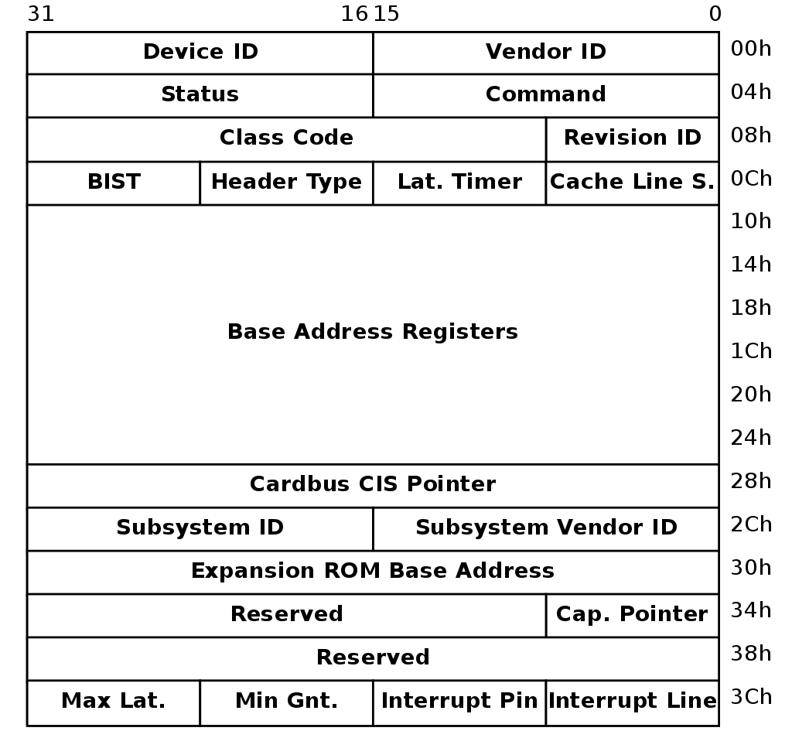
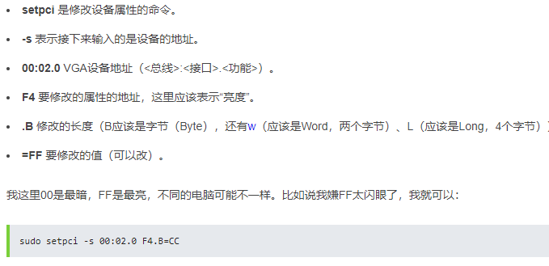
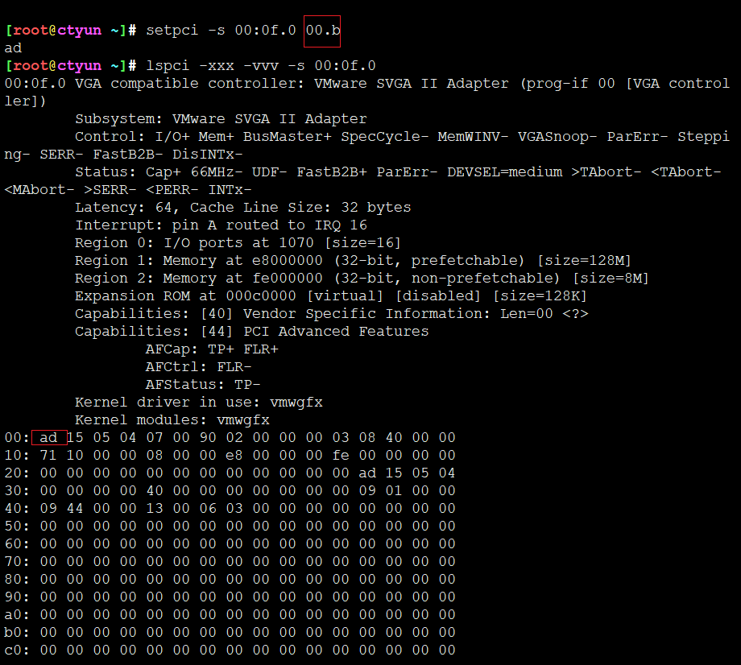
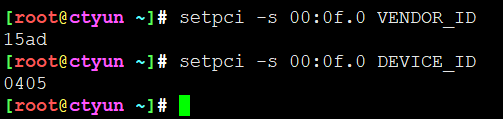
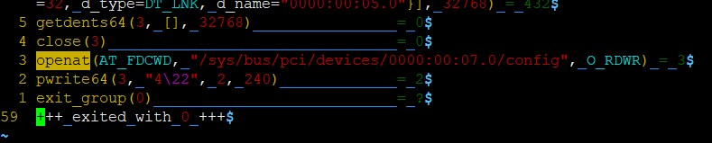
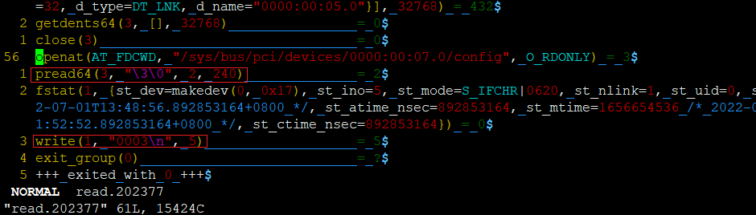

# setpci使用

## 帮助信息

```
[root@rocky-clion /data/pciutils-3.7.0.git]# setpci --help
Usage: setpci [<options>] (<device>+ <reg>[=<values>]*)*

General options:
-f		Don't complain if there's nothing to do
-v		Be verbose
-D		List changes, don't commit them
-r		Use raw access without bus scan if possible
--dumpregs	Dump all known register names and exit

PCI access options:
-A <method>	Use the specified PCI access method (see `-A help' for a list)
-O <par>=<val>	Set PCI access parameter (see `-O help' for a list)
-G		Enable PCI access debugging
-H <mode>	Use direct hardware access (<mode> = 1 or 2)

Setting commands:
<device>:	-s [[[<domain>]:][<bus>]:][<slot>][.[<func>]]
		-d [<vendor>]:[<device>]
<reg>:		<base>[+<offset>][.(B|W|L)][@<number>]
<base>:		<address>
		<named-register>
		[E]CAP_<capability-name>
		[E]CAP<capability-number>
<values>:	<value>[,<value>...]
<value>:	<hex>
		<hex>:<mask>

```

* ```setpci [<options>] (<device>+ <reg>[=<values>]*)*```是基本格式
* 如何锚定设备呢？两种方式，一种是根据设备的slot槽，``` -s [[[<domain>]:][<bus>]:][<slot>][.[<func>]]```，还有一种是根据```-d [<vendor>]:[<device>]```
* 具体值应该根据，pci设备的config内容来定。



* config前64字节是固定内容，可解析字段包括
* 具体setpci如何使用呢？<https://github.com/search?l=Shell&q=setpci&type=Code>


```
[root@rocky /data/pciutils-3.7.0.git]# setpci --dumpregs
cap pos w name
     00 W VENDOR_ID
     02 W DEVICE_ID
     04 W COMMAND
     06 W STATUS
     08 B REVISION
     09 B CLASS_PROG
     0a W CLASS_DEVICE
     0c B CACHE_LINE_SIZE
     0d B LATENCY_TIMER
     0e B HEADER_TYPE
     0f B BIST
     10 L BASE_ADDRESS_0
     14 L BASE_ADDRESS_1
     18 L BASE_ADDRESS_2
     1c L BASE_ADDRESS_3
     20 L BASE_ADDRESS_4
     24 L BASE_ADDRESS_5
     28 L CARDBUS_CIS
  ...
```





* setpci获取现有值







## 修改网卡连接速度

```
#!/bin/bash

dev=$1
speed=$2

if [ -z "$dev" ]; then
    echo "Error: no device specified"
    exit 1
fi

if [ ! -e "/sys/bus/pci/devices/$dev" ]; then
    dev="0000:$dev"
fi

if [ ! -e "/sys/bus/pci/devices/$dev" ]; then
    echo "Error: device $dev not found"
    exit 1
fi

pciec=$(setpci -s $dev CAP_EXP+02.W)
pt=$((("0x$pciec" & 0xF0) >> 4))

port=$(basename $(dirname $(readlink "/sys/bus/pci/devices/$dev")))

if (($pt == 0)) || (($pt == 1)) || (($pt == 5)); then
    dev=$port
fi

lc=$(setpci -s $dev CAP_EXP+0c.L)
ls=$(setpci -s $dev CAP_EXP+12.W)

max_speed=$(("0x$lc" & 0xF))

echo "Link capabilities:" $lc
echo "Max link speed:" $max_speed
echo "Link status:" $ls
echo "Current link speed:" $(("0x$ls" & 0xF))

if [ -z "$speed" ]; then
    speed=$max_speed
fi

if (($speed > $max_speed)); then
    speed=$max_speed
fi

echo "Configuring $dev..."

lc2=$(setpci -s $dev CAP_EXP+30.L)

echo "Original link control 2:" $lc2
echo "Original link target speed:" $(("0x$lc2" & 0xF))

lc2n=$(printf "%08x" $((("0x$lc2" & 0xFFFFFFF0) | $speed)))

echo "New target link speed:" $speed
echo "New link control 2:" $lc2n

setpci -s $dev CAP_EXP+30.L=$lc2n

echo "Triggering link retraining..."

lc=$(setpci -s $dev CAP_EXP+10.L)

echo "Original link control:" $lc

lcn=$(printf "%08x" $(("0x$lc" | 0x20)))

echo "New link control:" $lcn

setpci -s $dev CAP_EXP+10.L=$lcn

sleep 0.1

ls=$(setpci -s $dev CAP_EXP+12.W)

echo "Link status:" $ls
echo "Current link speed:" $(("0x$ls" & 0xF))
```


## strace分析写入

```
strace -o write -ff -v -s 10240 setpci -s 00:07.0 f0.w=0x1234
```



```
ssize_t pwrite(int fd, const void *buf, size_t count, off_t offset);
```

* 偏移offset写入count大小的buf到fd中，其中fd就是```/sys/bus/pci/devices/0000:00:07.0/config```
* pciutils 写入配置，其实也是写入到sysfs中

```
strace -o read -ff -v -s 10240 setpci -s 00:07.0 f0.w
```



* setpci也可以读，它将会通过给定的设备和偏移和大小读取，然后写到stdout，1号文件描述符


---
