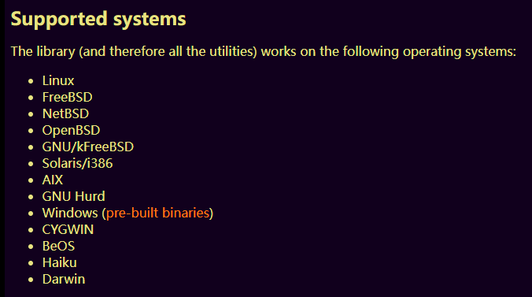

# spec分析

## SPEC内容

```
Name:		pciutils
Version:	3.7.0
Release:	1%{?dist}
Source:		https://mirrors.edge.kernel.org/pub/software/utils/pciutils/%{name}-%{version}.tar.xz
Source1:        multilibconfigh

#change pci.ids directory to hwdata, fedora/rhel specific
Patch1:		pciutils-2.2.1-idpath.patch

#add support for directory with another pci.ids, rejected by upstream, rhbz#195327
Patch2:		pciutils-dir-d.patch
Patch4:		pciutils-3.5.6-freefix.patch

# from upstream, for pciutils <= 3.7.0
Patch5:		pciutils-3.7.0-decodercec.patch

License:	GPLv2+
URL:		http://atrey.karlin.mff.cuni.cz/~mj/pciutils.shtml # https://mj.ucw.cz/sw/pciutils/
ExclusiveOS:	Linux
Requires:	hwdata
Requires:	%{name}-libs = %{version}-%{release}
BuildRequires: sed kmod-devel
Summary: PCI bus related utilities
Group: Applications/System

%description
The pciutils package contains various utilities for inspecting and
setting devices connected to the PCI bus.

%package devel
Summary: Linux PCI development library
Group: Development/Libraries
Requires: zlib-devel pkgconfig %{name} = %{version}-%{release}

%description devel
This package contains a library for inspecting and setting
devices connected to the PCI bus.

%package libs
Summary: Linux PCI library
Group: System Environment/Libraries

%description libs
This package contains a library for inspecting and setting
devices connected to the PCI bus.

%package devel-static
Summary: Linux PCI static library
Group: System Environment/Libraries
Requires: %{name}-devel = %{version}-%{release}

%description devel-static
This package contains a static library for inspecting and setting
devices connected to the PCI bus.

%prep
%setup -q -n pciutils-%{version}
%patch1 -p1 -b .idpath   # 备份，后缀添加.idpath
%patch2 -p1 -b .dird   # 备份，后缀添加.dird
%patch4 -p1 -b .freefix   # 备份，后缀添加.freefix
%patch5 -p1 -b .decodercec   # 备份，后缀添加.decodercec

%build
make SHARED="no" ZLIB="no" LIBKMOD=yes STRIP="" OPT="$RPM_OPT_FLAGS" \
  LDFLAGS="$RPM_LD_FLAGS" PREFIX="/usr" IDSDIR="/usr/share/hwdata" PCI_IDS="pci.ids" %{?_smp_mflags}
mv lib/libpci.a lib/libpci.a.toinstall

make clean

make SHARED="yes" ZLIB="no" LIBKMOD=yes STRIP="" OPT="$RPM_OPT_FLAGS" \
  LDFLAGS="$RPM_LD_FLAGS" PREFIX="/usr" LIBDIR="/%{_lib}" IDSDIR="/usr/share/hwdata" PCI_IDS="pci.ids" %{?_smp_mflags}

#fix lib vs. lib64 in libpci.pc (static Makefile is used)
sed -i "s|^libdir=.*$|libdir=/%{_lib}|" lib/libpci.pc


%install
rm -rf $RPM_BUILD_ROOT

install -d $RPM_BUILD_ROOT/{sbin,%{_sbindir},%{_lib},%{_mandir}/man8,%{_libdir},%{_libdir}/pkgconfig,%{_includedir}/pci}

install -p lspci setpci $RPM_BUILD_ROOT/sbin
install -p update-pciids $RPM_BUILD_ROOT/%{_sbindir}
install -p -m 644 lspci.8 setpci.8 update-pciids.8 $RPM_BUILD_ROOT%{_mandir}/man8
install -p lib/libpci.so.* $RPM_BUILD_ROOT/%{_lib}/
ln -s ../../%{_lib}/$(basename $RPM_BUILD_ROOT/%{_lib}/*.so.*.*.*) $RPM_BUILD_ROOT%{_libdir}/libpci.so

mv lib/libpci.a.toinstall lib/libpci.a
install -p -m 644 lib/libpci.a $RPM_BUILD_ROOT%{_libdir}
/sbin/ldconfig -N $RPM_BUILD_ROOT/%{_lib}
install -p lib/pci.h $RPM_BUILD_ROOT%{_includedir}/pci
install -p lib/header.h $RPM_BUILD_ROOT%{_includedir}/pci
install -p %{SOURCE1} $RPM_BUILD_ROOT%{_includedir}/pci/config.h
install -p lib/config.h $RPM_BUILD_ROOT%{_includedir}/pci/config.%{_lib}.h
install -p lib/types.h $RPM_BUILD_ROOT%{_includedir}/pci
install -p lib/libpci.pc $RPM_BUILD_ROOT%{_libdir}/pkgconfig

%post libs -p /sbin/ldconfig

%postun libs -p /sbin/ldconfig

%files
%doc README ChangeLog pciutils.lsm
/sbin/lspci
/sbin/setpci
%{_sbindir}/update-pciids
%{_mandir}/man8/*

%files libs
%license COPYING
/%{_lib}/libpci.so.*

%files devel-static
%{_libdir}/libpci.a

%files devel
%defattr(0644, root, root, 0755)
%{_libdir}/pkgconfig/libpci.pc
%{_libdir}/libpci.so
%{_includedir}/pci

%changelog
...
```


```
The PCI Utilities are a collection of programs for inspecting and manipulating configuration of PCI devices,
all based on a common portable library libpci which offers access to the PCI configuration space on a variety of operating systems.

The utilities include: (See their manual pages for more details)

lspci
  displays detailed information about all PCI buses and devices in the system
setpci
  allows reading from and writing to PCI device configuration registers. For example, you can adjust the latency timers with it.
```




* 主要是两个工具，并且支持众多平台
* GiHub仓库:<https://github.com/pciutils/pciutils>
* kernel仓库:<git://git.kernel.org/pub/scm/utils/pciutils/pciutils.git>


## 编译过程

```
+ cd /root/rpmbuild/BUILD
+ cd pciutils-3.7.0
+ make SHARED=no ZLIB=no LIBKMOD=yes STRIP= 'OPT=-O2 -g -pipe -Wall -Werror=format-security -Wp,-D_FORTIFY_SOURCE=2 -Wp,-D_GLIBCXX_ASSERTIONS -fexceptions -fstack-protector-strong -grecord-gcc-switches -specs=/usr/lib/rpm/redhat/redhat-hardened-cc1 -specs=/usr/lib/rpm/redhat/redhat-annobin-cc1 -m64 -mtune=generic -fasynchronous-unwind-tables -fstack-clash-protection -fcf-protection' 'LDFLAGS=-Wl,-z,relro  -Wl,-z,now -specs=/usr/lib/rpm/redhat/redhat-hardened-ld' PREFIX=/usr IDSDIR=/usr/share/hwdata PCI_IDS=pci.ids -j16
+ mv lib/libpci.a lib/libpci.a.toinstall
+ make clean
rm -f `find . -name "*~" -o -name "*.[oa]" -o -name "\#*\#" -o -name TAGS -o -name core -o -name "*.orig"`
rm -f update-pciids lspci setpci example lib/config.* *.[578] pci.ids.gz lib/*.pc lib/*.so lib/*.so.* tags
rm -rf maint/dist
+ make SHARED=yes ZLIB=no LIBKMOD=yes STRIP= 'OPT=-O2 -g -pipe -Wall -Werror=format-security -Wp,-D_FORTIFY_SOURCE=2 -Wp,-D_GLIBCXX_ASSERTIONS -fexceptions -fstack-protector-strong -grecord-gcc-switches -specs=/usr/lib/rpm/redhat/redhat-hardened-cc1 -specs=/usr/lib/rpm/redhat/redhat-annobin-cc1 -m64 -mtune=generic -fasynchronous-unwind-tables -fstack-clash-protection -fcf-protection' 'LDFLAGS=-Wl,-z,relro  -Wl,-z,now -specs=/usr/lib/rpm/redhat/redhat-hardened-ld' PREFIX=/usr LIBDIR=/lib64 IDSDIR=/usr/share/hwdata PCI_IDS=pci.ids -j16
cd lib && ./configure
+ sed -i 's|^libdir=.*$|libdir=/lib64|' lib/libpci.pc
+ exit 0
```


--
