# strace分析程序调用

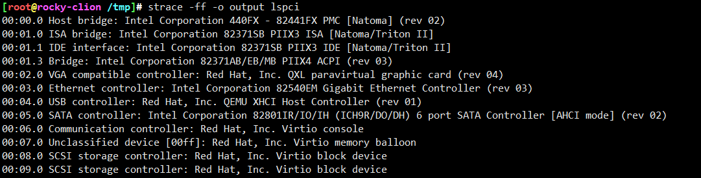

```
[root@rocky-clion /tmp]# cat output.182140 |grep "^open"
openat(AT_FDCWD, "/etc/ld.so.cache", O_RDONLY|O_CLOEXEC) = 3
openat(AT_FDCWD, "/lib64/libpci.so.3", O_RDONLY|O_CLOEXEC) = 3
openat(AT_FDCWD, "/lib64/libkmod.so.2", O_RDONLY|O_CLOEXEC) = 3
openat(AT_FDCWD, "/lib64/libc.so.6", O_RDONLY|O_CLOEXEC) = 3
openat(AT_FDCWD, "/lib64/libresolv.so.2", O_RDONLY|O_CLOEXEC) = 3
openat(AT_FDCWD, "/lib64/liblzma.so.5", O_RDONLY|O_CLOEXEC) = 3
openat(AT_FDCWD, "/lib64/libz.so.1", O_RDONLY|O_CLOEXEC) = 3
openat(AT_FDCWD, "/lib64/libssl.so.1.1", O_RDONLY|O_CLOEXEC) = 3
openat(AT_FDCWD, "/lib64/libcrypto.so.1.1", O_RDONLY|O_CLOEXEC) = 3
openat(AT_FDCWD, "/lib64/libgcc_s.so.1", O_RDONLY|O_CLOEXEC) = 3
openat(AT_FDCWD, "/lib64/libpthread.so.0", O_RDONLY|O_CLOEXEC) = 3
openat(AT_FDCWD, "/lib64/libdl.so.2", O_RDONLY|O_CLOEXEC) = 3
openat(AT_FDCWD, "/proc/sys/crypto/fips_enabled", O_RDONLY) = 3
openat(AT_FDCWD, "/sys/bus/pci/devices", O_RDONLY|O_NONBLOCK|O_CLOEXEC|O_DIRECTORY) = 3
openat(AT_FDCWD, "/sys/bus/pci/devices/0000:00:05.0/config", O_RDONLY) = 3
openat(AT_FDCWD, "/sys/bus/pci/devices/0000:00:05.0/vendor", O_RDONLY) = 4
openat(AT_FDCWD, "/sys/bus/pci/devices/0000:00:05.0/device", O_RDONLY) = 4
openat(AT_FDCWD, "/sys/bus/pci/devices/0000:00:05.0/class", O_RDONLY) = 4
openat(AT_FDCWD, "/sys/bus/pci/devices/0000:00:02.0/config", O_RDONLY) = 3
openat(AT_FDCWD, "/sys/bus/pci/devices/0000:00:02.0/vendor", O_RDONLY) = 4
openat(AT_FDCWD, "/sys/bus/pci/devices/0000:00:02.0/device", O_RDONLY) = 4
openat(AT_FDCWD, "/sys/bus/pci/devices/0000:00:02.0/class", O_RDONLY) = 4
openat(AT_FDCWD, "/sys/bus/pci/devices/0000:00:09.0/config", O_RDONLY) = 3
openat(AT_FDCWD, "/sys/bus/pci/devices/0000:00:09.0/vendor", O_RDONLY) = 4
openat(AT_FDCWD, "/sys/bus/pci/devices/0000:00:09.0/device", O_RDONLY) = 4
openat(AT_FDCWD, "/sys/bus/pci/devices/0000:00:09.0/class", O_RDONLY) = 4
openat(AT_FDCWD, "/sys/bus/pci/devices/0000:00:06.0/config", O_RDONLY) = 3
openat(AT_FDCWD, "/sys/bus/pci/devices/0000:00:06.0/vendor", O_RDONLY) = 4
openat(AT_FDCWD, "/sys/bus/pci/devices/0000:00:06.0/device", O_RDONLY) = 4
openat(AT_FDCWD, "/sys/bus/pci/devices/0000:00:06.0/class", O_RDONLY) = 4
openat(AT_FDCWD, "/sys/bus/pci/devices/0000:00:01.1/config", O_RDONLY) = 3
openat(AT_FDCWD, "/sys/bus/pci/devices/0000:00:01.1/vendor", O_RDONLY) = 4
openat(AT_FDCWD, "/sys/bus/pci/devices/0000:00:01.1/device", O_RDONLY) = 4
openat(AT_FDCWD, "/sys/bus/pci/devices/0000:00:01.1/class", O_RDONLY) = 4
openat(AT_FDCWD, "/sys/bus/pci/devices/0000:00:03.0/config", O_RDONLY) = 3
openat(AT_FDCWD, "/sys/bus/pci/devices/0000:00:03.0/vendor", O_RDONLY) = 4
openat(AT_FDCWD, "/sys/bus/pci/devices/0000:00:03.0/device", O_RDONLY) = 4
openat(AT_FDCWD, "/sys/bus/pci/devices/0000:00:03.0/class", O_RDONLY) = 4
openat(AT_FDCWD, "/sys/bus/pci/devices/0000:00:01.3/config", O_RDONLY) = 3
openat(AT_FDCWD, "/sys/bus/pci/devices/0000:00:01.3/vendor", O_RDONLY) = 4
openat(AT_FDCWD, "/sys/bus/pci/devices/0000:00:01.3/device", O_RDONLY) = 4
openat(AT_FDCWD, "/sys/bus/pci/devices/0000:00:01.3/class", O_RDONLY) = 4
openat(AT_FDCWD, "/sys/bus/pci/devices/0000:00:00.0/config", O_RDONLY) = 3
openat(AT_FDCWD, "/sys/bus/pci/devices/0000:00:00.0/vendor", O_RDONLY) = 4
openat(AT_FDCWD, "/sys/bus/pci/devices/0000:00:00.0/device", O_RDONLY) = 4
openat(AT_FDCWD, "/sys/bus/pci/devices/0000:00:00.0/class", O_RDONLY) = 4
openat(AT_FDCWD, "/sys/bus/pci/devices/0000:00:07.0/config", O_RDONLY) = 3
openat(AT_FDCWD, "/sys/bus/pci/devices/0000:00:07.0/vendor", O_RDONLY) = 4
openat(AT_FDCWD, "/sys/bus/pci/devices/0000:00:07.0/device", O_RDONLY) = 4
openat(AT_FDCWD, "/sys/bus/pci/devices/0000:00:07.0/class", O_RDONLY) = 4
openat(AT_FDCWD, "/sys/bus/pci/devices/0000:00:04.0/config", O_RDONLY) = 3
openat(AT_FDCWD, "/sys/bus/pci/devices/0000:00:04.0/vendor", O_RDONLY) = 4
openat(AT_FDCWD, "/sys/bus/pci/devices/0000:00:04.0/device", O_RDONLY) = 4
openat(AT_FDCWD, "/sys/bus/pci/devices/0000:00:04.0/class", O_RDONLY) = 4
openat(AT_FDCWD, "/sys/bus/pci/devices/0000:00:01.0/config", O_RDONLY) = 3
openat(AT_FDCWD, "/sys/bus/pci/devices/0000:00:01.0/vendor", O_RDONLY) = 4
openat(AT_FDCWD, "/sys/bus/pci/devices/0000:00:01.0/device", O_RDONLY) = 4
openat(AT_FDCWD, "/sys/bus/pci/devices/0000:00:01.0/class", O_RDONLY) = 4
openat(AT_FDCWD, "/sys/bus/pci/devices/0000:00:08.0/config", O_RDONLY) = 3
openat(AT_FDCWD, "/sys/bus/pci/devices/0000:00:08.0/vendor", O_RDONLY) = 4
openat(AT_FDCWD, "/sys/bus/pci/devices/0000:00:08.0/device", O_RDONLY) = 4
openat(AT_FDCWD, "/sys/bus/pci/devices/0000:00:08.0/class", O_RDONLY) = 4
openat(AT_FDCWD, "/usr/share/hwdata/pci.ids", O_RDONLY) = 4
openat(AT_FDCWD, "/usr/share/hwdata/pci.ids.d/", O_RDONLY|O_NONBLOCK|O_CLOEXEC|O_DIRECTORY) = -1 ENOENT (No such file or directory)
openat(AT_FDCWD, "/etc/nsswitch.conf", O_RDONLY|O_CLOEXEC) = 4
openat(AT_FDCWD, "/etc/ld.so.cache", O_RDONLY|O_CLOEXEC) = 4
openat(AT_FDCWD, "/lib64/libnss_sss.so.2", O_RDONLY|O_CLOEXEC) = 4
openat(AT_FDCWD, "/var/lib/sss/mc/passwd", O_RDONLY|O_CLOEXEC) = 4
openat(AT_FDCWD, "/etc/ld.so.cache", O_RDONLY|O_CLOEXEC) = 6
openat(AT_FDCWD, "/lib64/libnss_files.so.2", O_RDONLY|O_CLOEXEC) = 6
openat(AT_FDCWD, "/etc/passwd", O_RDONLY|O_CLOEXEC) = 6
openat(AT_FDCWD, "/root/.pciids-cache", O_RDONLY) = 6
```

* ```uevent:5:PCI_SLOT_NAME=0000:00:09.0```
* 域(domain):总线(bus):设备号(slot):功能号(func)

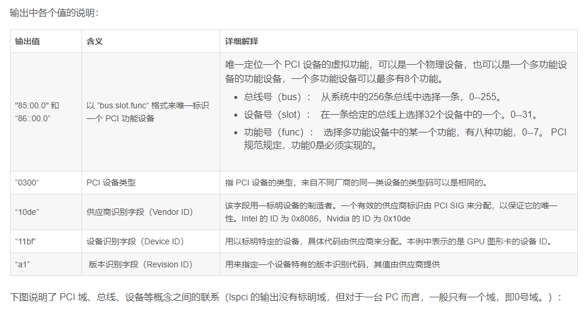

```
00:09.0 SCSI storage controller [0100]: Red Hat, Inc. Virtio block device [1af4:1001]
	Subsystem: Red Hat, Inc. Device [1af4:0002]
	Physical Slot: 9
	Control: I/O+ Mem+ BusMaster+ SpecCycle- MemWINV- VGASnoop- ParErr- Stepping- SERR+ FastB2B- DisINTx+
	Status: Cap+ 66MHz- UDF- FastB2B- ParErr- DEVSEL=fast >TAbort- <TAbort- <MAbort- >SERR- <PERR- INTx-
	Latency: 0
	Interrupt: pin A routed to IRQ 10
	Region 0: I/O ports at c0c0 [size=64]
	Region 1: Memory at fc079000 (32-bit, non-prefetchable) [size=4K]
	Region 4: Memory at febfc000 (64-bit, prefetchable) [size=16K]
	Capabilities: [98] MSI-X: Enable+ Count=2 Masked-
		Vector table: BAR=1 offset=00000000
		PBA: BAR=1 offset=00000800
	Capabilities: [84] Vendor Specific Information: VirtIO: <unknown>
		BAR=0 offset=00000000 size=00000000
	Capabilities: [70] Vendor Specific Information: VirtIO: Notify
		BAR=4 offset=00003000 size=00001000 multiplier=00000004
	Capabilities: [60] Vendor Specific Information: VirtIO: DeviceCfg
		BAR=4 offset=00002000 size=00001000
	Capabilities: [50] Vendor Specific Information: VirtIO: ISR
		BAR=4 offset=00001000 size=00001000
	Capabilities: [40] Vendor Specific Information: VirtIO: CommonCfg
		BAR=4 offset=00000000 size=00001000
	Kernel driver in use: virtio-pci
00: f4 1a 01 10 07 05 10 00 00 00 00 01 00 00 00 00
10: c1 c0 00 00 00 90 07 fc 00 00 00 00 00 00 00 00
20: 0c c0 bf fe 00 00 00 00 00 00 00 00 f4 1a 02 00
30: 00 00 00 00 98 00 00 00 00 00 00 00 0a 01 00 00
40: 09 00 10 01 04 00 00 00 00 00 00 00 00 10 00 00
50: 09 40 10 03 04 00 00 00 00 10 00 00 00 10 00 00
60: 09 50 10 04 04 00 00 00 00 20 00 00 00 10 00 00
70: 09 60 14 02 04 00 00 00 00 30 00 00 00 10 00 00
80: 04 00 00 00 09 70 14 05 00 00 00 00 00 00 00 00
90: 00 00 00 00 00 00 00 00 11 84 01 80 01 00 00 00
a0: 01 08 00 00 00 00 00 00 00 00 00 00 00 00 00 00
b0: 00 00 00 00 00 00 00 00 00 00 00 00 00 00 00 00
c0: 00 00 00 00 00 00 00 00 00 00 00 00 00 00 00 00
d0: 00 00 00 00 00 00 00 00 00 00 00 00 00 00 00 00
e0: 00 00 00 00 00 00 00 00 00 00 00 00 00 00 00 00
f0: 00 00 00 00 00 00 00 00 00 00 00 00 00 00 00 00
```

以00:09.0总线设备为例，读取了三个文件

```
openat(AT_FDCWD, "/sys/bus/pci/devices/0000:00:09.0/config", O_RDONLY) = 3
openat(AT_FDCWD, "/sys/bus/pci/devices/0000:00:09.0/vendor", O_RDONLY) = 4
openat(AT_FDCWD, "/sys/bus/pci/devices/0000:00:09.0/device", O_RDONLY) = 4
openat(AT_FDCWD, "/sys/bus/pci/devices/0000:00:09.0/class", O_RDONLY) = 4
```

## config文件

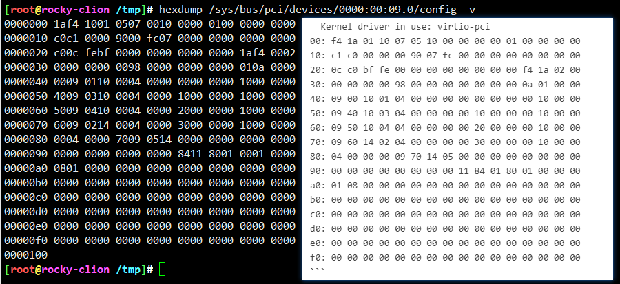

## vendor文件、device文件、class文件

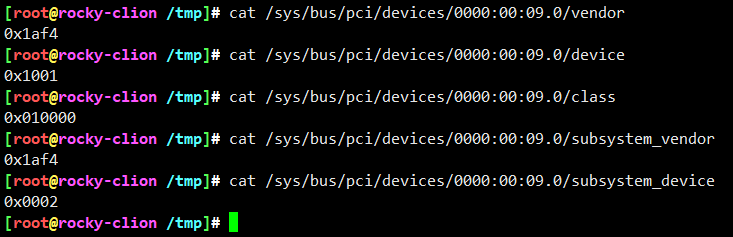

上述这些字段值，在通过pciids信息，就可以转为人可识别的内容

```
SCSI storage controller [0100]: Red Hat, Inc. Virtio block device [1af4:1001]
	Subsystem: Red Hat, Inc. Device [1af4:0002]
```


## Physical Slot值是从何而来？

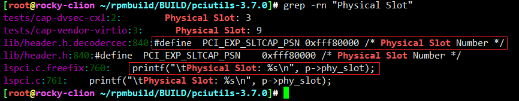

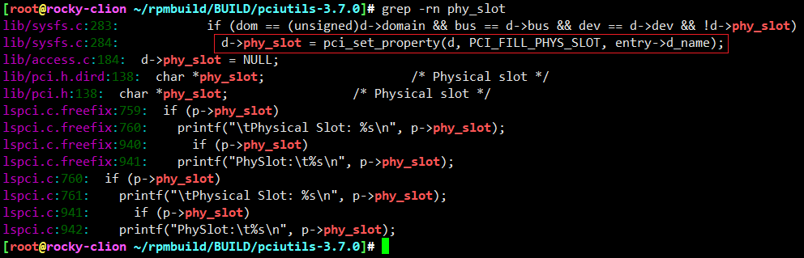

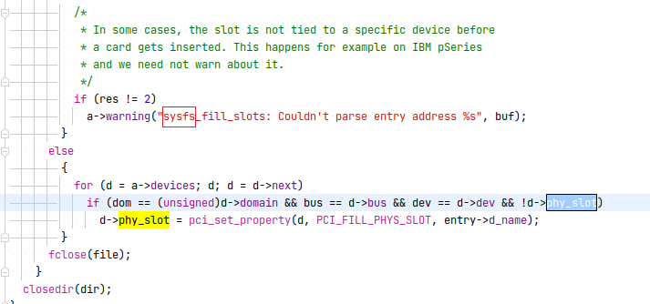

看样子也是从sysfs中获取slot信息，那么具体是通过啥呢？

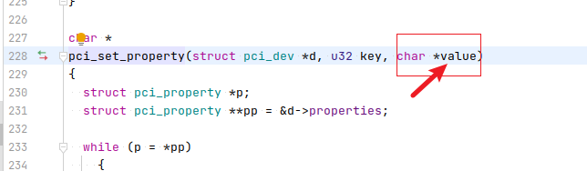

看具体value，value哪里赋值的？

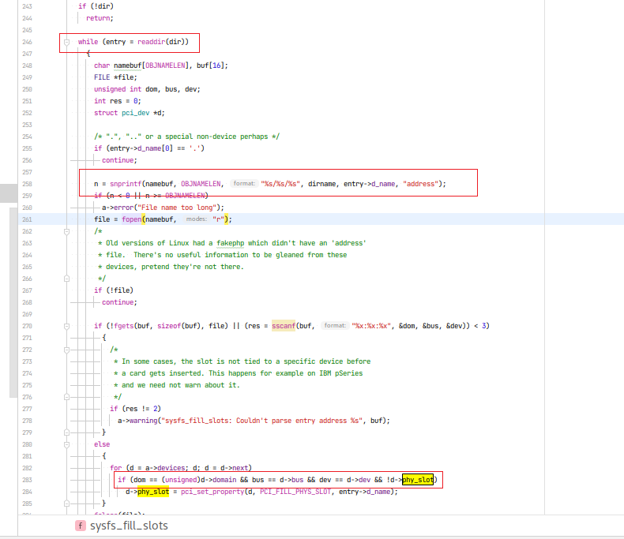

此处是一个循环，其实就是遍历```/sys/bus/pci/slots```目录，子目录为每个设备的slot，每个子目录存放设备信息。
这里就是通过比对设备信息间接获取slot的。因此这里entry->d_name其实就是遍历后与当前设备匹配的slot赋值了

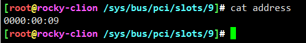

具体比对呢，就是```/sys/bus/pci/slots/9/address```与``/sys/bus/pci/devices/0000:00:09.0```一致即可

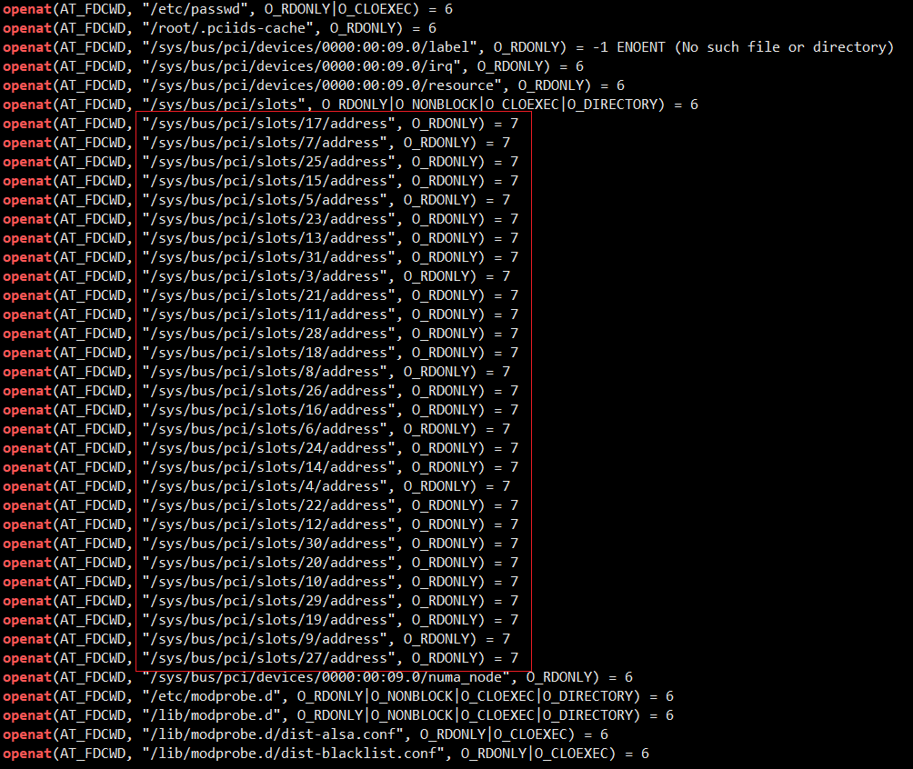

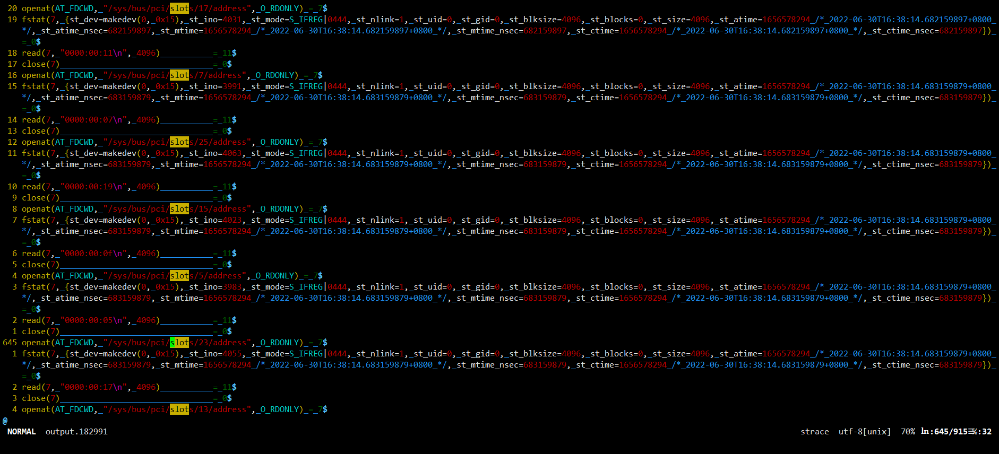

去国外看了下，还真有类似问题。。

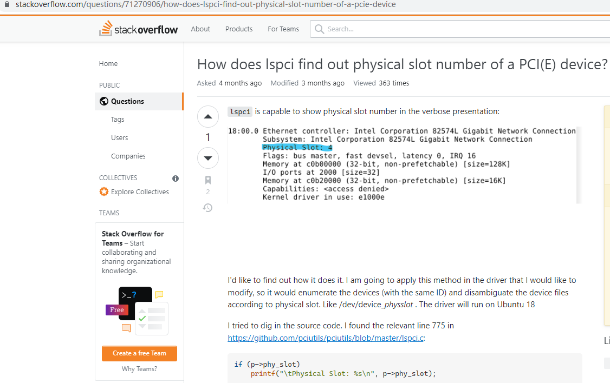

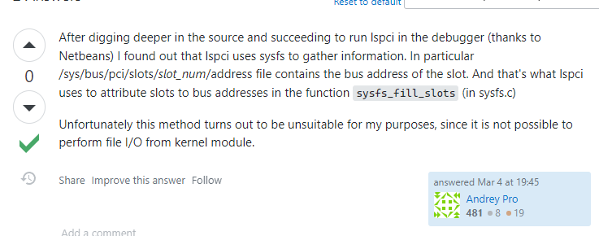


## 总结

* pciutils其实就是操作```/sys/bus/pci```目录而已


---
