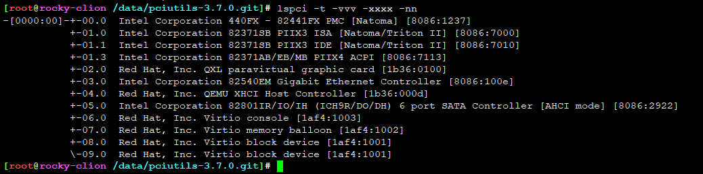

# update-pciids脚本

代码比较简短，直接贴出来：

```
#!/bin/sh

[ "$1" = "-q" ] && quiet=true || quiet=false # 是否静默输出 && || 优先级，右到左

set -e
SRC="https://pci-ids.ucw.cz/v2.2/pci.ids" # 目标文件url
DEST=/usr/share/hwdata/pci.ids
PCI_COMPRESSED_IDS=
GREP=grep

# if pci.ids is read-only (because the filesystem is read-only),
# then just skip this whole process.
# 健全性检查，严谨滴判断了下，目标文件是否可以读写，
# 不能读写直接拜拜，反正后面操作肯定也是错，早死早超生
if ! touch ${DEST} >/dev/null 2>&1 ; then
	${quiet} || echo "${DEST} is read-only, exiting." 1>&2
	exit 1
fi

# 判断是否被压缩，如果压缩了，指定对应的压缩程序及文件后缀
if [ "$PCI_COMPRESSED_IDS" = 1 ] ; then
	DECOMP="cat"
	SRC="$SRC.gz"
	GREP=zgrep
elif which bzip2 >/dev/null 2>&1 ; then
	DECOMP="bzip2 -d"
	SRC="$SRC.bz2"
elif which gzip >/dev/null 2>&1 ; then
	DECOMP="gzip -d"
	SRC="$SRC.gz"
else
	DECOMP="cat"
fi
# 判断下载工具，一般用curl/wget
if which curl >/dev/null 2>&1 ; then
	DL="curl -o $DEST.new $SRC"
  # 若果要静默输出
    ${quiet} && DL="$DL -s -S"
elif which wget >/dev/null 2>&1 ; then
	DL="wget --no-timestamping -O $DEST.new $SRC"
  # 若果要静默输出
	${quiet} && DL="$DL -q"
elif which lynx >/dev/null 2>&1 ; then # lynx 是 A text-based Web browser ，文本浏览器
	DL="eval lynx -source $SRC >$DEST.new"
else
  # 至少有一个可用的下载工具，否则爆炸
	echo >&2 "update-pciids: cannot find curl, wget or lynx"
	exit 1
fi

# 执行DL命令，如果错误则爆炸。重定向到 $DEST.new 文件
if ! $DL ; then
	echo >&2 "update-pciids: download failed"
	rm -f $DEST.new
	exit 1
fi

# 解压文件到 $DEST.neww，解压失败则爆炸
if ! $DECOMP <$DEST.new >$DEST.neww ; then
	echo >&2 "update-pciids: decompression failed, probably truncated file"
	exit 1
fi

# 如果grep检索到文本中包含 '^C' ，则明显文本被阶段，直接爆炸
if ! $GREP >/dev/null "^C " $DEST.neww ; then
	echo >&2 "update-pciids: missing class info, probably truncated file"
	exit 1
fi

# 如果目标文件存在，则保存备份
if [ -f $DEST ] ; then
	mv $DEST $DEST.old
	# --reference is supported only by chmod from GNU file, so let's ignore any errors
  # 将 $DEST.neww 权限修改的与 $DEST.old 一致
	chmod -f --reference=$DEST.old $DEST.neww 2>/dev/null || true
fi
# $DEST.neww 重命名为 $DEST ，此时权限一致，名称一致，完全替换原先的ids
mv $DEST.neww $DEST
# 清空备胎
rm $DEST.new

# Older versions did not compress the ids file, so let's make sure we
# clean that up.
# 鉴权检查，清空备胎
if [ ${DEST%.gz} != ${DEST} ] ; then
	rm -f ${DEST%.gz} ${DEST%.gz}.old
fi

# 告诉你任务完成
${quiet} || echo "Done."
```

* 总结，从url下载文件到 /usr/share/hwdata/pci.ids 目录下而已


执行输出
```
[root@rocky /tmp]# update-pciids
+ '[' '' = -q ']'
+ quiet=false
+ set -e
+ SRC=https://pci-ids.ucw.cz/v2.2/pci.ids
+ DEST=/usr/share/hwdata/pci.ids
+ PCI_COMPRESSED_IDS=
+ GREP=grep
+ touch /usr/share/hwdata/pci.ids
+ '[' '' = 1 ']'
+ which bzip2
+ DECOMP='bzip2 -d'
+ SRC=https://pci-ids.ucw.cz/v2.2/pci.ids.bz2
+ which curl
+ DL='curl -o /usr/share/hwdata/pci.ids.new https://pci-ids.ucw.cz/v2.2/pci.ids.bz2'
+ false
+ curl -o /usr/share/hwdata/pci.ids.new https://pci-ids.ucw.cz/v2.2/pci.ids.bz2
  % Total    % Received % Xferd  Average Speed   Time    Time     Time  Current
                                 Dload  Upload   Total   Spent    Left  Speed
100  278k  100  278k    0     0   3484      0  0:01:21  0:01:21 --:--:-- 11049
+ bzip2 -d
+ grep '^C ' /usr/share/hwdata/pci.ids.neww
+ '[' -f /usr/share/hwdata/pci.ids ']'
+ mv /usr/share/hwdata/pci.ids /usr/share/hwdata/pci.ids.old
+ chmod -f --reference=/usr/share/hwdata/pci.ids.old /usr/share/hwdata/pci.ids.neww
+ mv /usr/share/hwdata/pci.ids.neww /usr/share/hwdata/pci.ids
+ rm /usr/share/hwdata/pci.ids.new
+ '[' /usr/share/hwdata/pci.ids '!=' /usr/share/hwdata/pci.ids ']'
+ false
+ echo Done.
Done.
```

* ```/usr/share/hwdata/pci.ids``` 属于 hwdata 包
* hwdata 上游 ```https://github.com/vcrhonek/hwdata```，对应Python版本 ```https://github.com/xsuchy/python-hwdata```
* ids是什么意思？ IDentifierS 的简写
* pci.ids - list of known identifiers related to PCI devices <https://man7.org/linux/man-pages/man5/pci.ids.5.html>

```
The pci.ids file is generated from the PCI ID database, which is
maintained at ⟨https://pci-ids.ucw.cz/⟩.  If you find any IDs
missing from the list, please contribute them to the database.

You can use the update-pciids command to download the current
version of the list.

Alternatively, you can use lspci -q to query the database online.
```

* pci.ids 就是 记录pci设备id对应厂家信息，最初来源来自于 <https://pci-ids.ucw.cz/>


```
[root@rocky /tmp]# rpm -qf /usr/share/hwdata/pci.ids
hwdata-0.314-8.12.el8.noarch
[root@rocky /tmp]# rpm -V hwdata
S.5....T.    /usr/share/hwdata/pci.ids
[root@rocky /tmp]# yum info hwdata
Last metadata expiration check: 0:32:35 ago on Wed 29 Jun 2022 09:29:49 PM CST.
Installed Packages
Name         : hwdata
Version      : 0.314
Release      : 8.12.el8
Architecture : noarch
Size         : 8.3 M
Source       : hwdata-0.314-8.12.el8.src.rpm
Repository   : @System
From repo    : anaconda
Summary      : Hardware identification and configuration data
URL          : https://github.com/vcrhonek/hwdata
License      : GPLv2+
Description  : hwdata contains various hardware identification and configuration data,
             : such as the pci.ids and usb.ids databases.
[root@rocky ~/rpmbuild/SOURCES]# rpm -ql hwdata
/usr/lib/modprobe.d/dist-blacklist.conf
/usr/share/doc/hwdata
/usr/share/doc/hwdata/COPYING
/usr/share/doc/hwdata/LICENSE
/usr/share/hwdata
/usr/share/hwdata/iab.txt
/usr/share/hwdata/oui.txt
/usr/share/hwdata/pci.ids
/usr/share/hwdata/pnp.ids
/usr/share/hwdata/usb.ids
```


## pci.ids

* 包含三个类型字段，Vendors, devices and subsystems ， 有序存放
* 其中 subsystems 不一定有，可以忽略
* 一般用 Vendors-devices 锚定一个设备类型。如果厂家比较大，才会有subsystems

* 两种语法格式

第一种语法：

```
vendor  vendor_name
	  device  device_name				<-- single tab
		  subvendor subdevice  subsystem_name	<-- two tabs
```

* '#' 开头是注释
* vender 两个字节，2^16 次方，硬件厂商只能有 2^16 次方个
* device_name 两个字节，2^16 次方，硬件厂商的核心设备只能有 2^16 次方个
* subsystems 两个字节，2^32 次方，硬件厂商的核心设备的子系统可以有 2^32 次方个
* 数量与硬件厂商，完全够用？也许1亿年以后爆满吧。至少近百年够用


```
1af4  Red Hat, Inc.
	1000  Virtio network device
		01de fffb  Propolis Virtio network device
	1001  Virtio block device
		01de fffa  Propolis Virtio block device
	1002  Virtio memory balloon
	1003  Virtio console
	1004  Virtio SCSI
	1005  Virtio RNG
	1009  Virtio filesystem
0731  Jingjia Microelectronics Co Ltd
	7200  JM7200 Series GPU
		0731 7201  JM7201
		0731 7202  JM7202
		0731 7208  JM7200
		0731 7212  JM7200
		0731 7214  JM7500
		0731 7215  JM7200
```

第二种语法

* 列出 device classes, subclasses and programming interfaces

```
C class	class_name
  subclass	subclass_name  		<-- single tab
    prog-if  prog-if_name  	<-- two tabs
```

* class 一个字节，8位，2^8 256种
* subclass_name 一个字节，8位，2^8 256种
* programming interfaces 一个字节，8位，2^8 256种


```
C 01  Mass storage controller
	00  SCSI storage controller
	01  IDE interface
		00  ISA Compatibility mode-only controller
```

* 第二种语法数量比较少，直接给出
* 每个设备，必定属于某一个控制器下，或者说属于某一类接口设备。然后在有设备本身厂家信息

```
C 00  Unclassified device
	00  Non-VGA unclassified device
	01  VGA compatible unclassified device
	05  Image coprocessor
C 01  Mass storage controller
	00  SCSI storage controller
	01  IDE interface
		00  ISA Compatibility mode-only controller
		05  PCI native mode-only controller
		0a  ISA Compatibility mode controller, supports both channels switched to PCI native mode
		0f  PCI native mode controller, supports both channels switched to ISA compatibility mode
		80  ISA Compatibility mode-only controller, supports bus mastering
		85  PCI native mode-only controller, supports bus mastering
		8a  ISA Compatibility mode controller, supports both channels switched to PCI native mode, supports bus mastering
		8f  PCI native mode controller, supports both channels switched to ISA compatibility mode, supports bus mastering
	02  Floppy disk controller
	03  IPI bus controller
	04  RAID bus controller
	05  ATA controller
		20  ADMA single stepping
		30  ADMA continuous operation
	06  SATA controller
		00  Vendor specific
		01  AHCI 1.0
		02  Serial Storage Bus
	07  Serial Attached SCSI controller
		01  Serial Storage Bus
	08  Non-Volatile memory controller
		01  NVMHCI
		02  NVM Express
	80  Mass storage controller
C 02  Network controller
	00  Ethernet controller
	01  Token ring network controller
	02  FDDI network controller
	03  ATM network controller
	04  ISDN controller
	05  WorldFip controller
	06  PICMG controller
	07  Infiniband controller
	08  Fabric controller
	80  Network controller
C 03  Display controller
	00  VGA compatible controller
		00  VGA controller
		01  8514 controller
	01  XGA compatible controller
	02  3D controller
	80  Display controller
C 04  Multimedia controller
	00  Multimedia video controller
	01  Multimedia audio controller
	02  Computer telephony device
	03  Audio device
	80  Multimedia controller
C 05  Memory controller
	00  RAM memory
	01  FLASH memory
	02  CXL
		00  CXL Memory Device - vendor specific
		10  CXL Memory Device (CXL 2.x)
	80  Memory controller
C 06  Bridge
	00  Host bridge
	01  ISA bridge
	02  EISA bridge
	03  MicroChannel bridge
	04  PCI bridge
		00  Normal decode
		01  Subtractive decode
	05  PCMCIA bridge
	06  NuBus bridge
	07  CardBus bridge
	08  RACEway bridge
		00  Transparent mode
		01  Endpoint mode
	09  Semi-transparent PCI-to-PCI bridge
		40  Primary bus towards host CPU
		80  Secondary bus towards host CPU
	0a  InfiniBand to PCI host bridge
	80  Bridge
C 07  Communication controller
	00  Serial controller
		00  8250
		01  16450
		02  16550
		03  16650
		04  16750
		05  16850
		06  16950
	01  Parallel controller
		00  SPP
		01  BiDir
		02  ECP
		03  IEEE1284
		fe  IEEE1284 Target
	02  Multiport serial controller
	03  Modem
		00  Generic
		01  Hayes/16450
		02  Hayes/16550
		03  Hayes/16650
		04  Hayes/16750
	04  GPIB controller
	05  Smard Card controller
	80  Communication controller
C 08  Generic system peripheral
	00  PIC
		00  8259
		01  ISA PIC
		02  EISA PIC
		10  IO-APIC
		20  IO(X)-APIC
	01  DMA controller
		00  8237
		01  ISA DMA
		02  EISA DMA
	02  Timer
		00  8254
		01  ISA Timer
		02  EISA Timers
		03  HPET
	03  RTC
		00  Generic
		01  ISA RTC
	04  PCI Hot-plug controller
	05  SD Host controller
	06  IOMMU
	80  System peripheral
	99  Timing Card
# PTP Grandmaster Source Clock
		01  TAP Timing Card
C 09  Input device controller
	00  Keyboard controller
	01  Digitizer Pen
	02  Mouse controller
	03  Scanner controller
	04  Gameport controller
		00  Generic
		10  Extended
	80  Input device controller
C 0a  Docking station
	00  Generic Docking Station
	80  Docking Station
C 0b  Processor
	00  386
	01  486
	02  Pentium
	10  Alpha
	20  Power PC
	30  MIPS
	40  Co-processor
C 0c  Serial bus controller
	00  FireWire (IEEE 1394)
		00  Generic
		10  OHCI
	01  ACCESS Bus
	02  SSA
	03  USB controller
		00  UHCI
		10  OHCI
		20  EHCI
		30  XHCI
		40  USB4 Host Interface
		80  Unspecified
		fe  USB Device
	04  Fibre Channel
	05  SMBus
	06  InfiniBand
	07  IPMI Interface
		00  SMIC
		01  KCS
		02  BT (Block Transfer)
	08  SERCOS interface
	09  CANBUS
	80  Serial bus controller
C 0d  Wireless controller
	00  IRDA controller
	01  Consumer IR controller
	10  RF controller
	11  Bluetooth
	12  Broadband
	20  802.1a controller
	21  802.1b controller
	80  Wireless controller
C 0e  Intelligent controller
	00  I2O
C 0f  Satellite communications controller
	01  Satellite TV controller
	02  Satellite audio communication controller
	03  Satellite voice communication controller
	04  Satellite data communication controller
C 10  Encryption controller
	00  Network and computing encryption device
	10  Entertainment encryption device
	80  Encryption controller
C 11  Signal processing controller
	00  DPIO module
	01  Performance counters
	10  Communication synchronizer
	20  Signal processing management
	80  Signal processing controller
C 12  Processing accelerators
	00  Processing accelerators
	01  SNIA Smart Data Accelerator Interface (SDXI) controller
C 13  Non-Essential Instrumentation
C 40  Coprocessor
C ff  Unassigned class
```





## 手动解析


---
